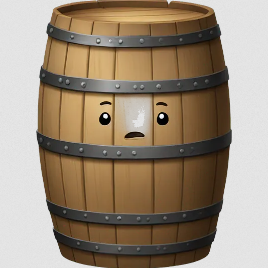
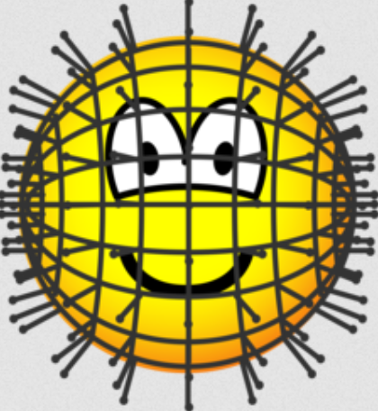
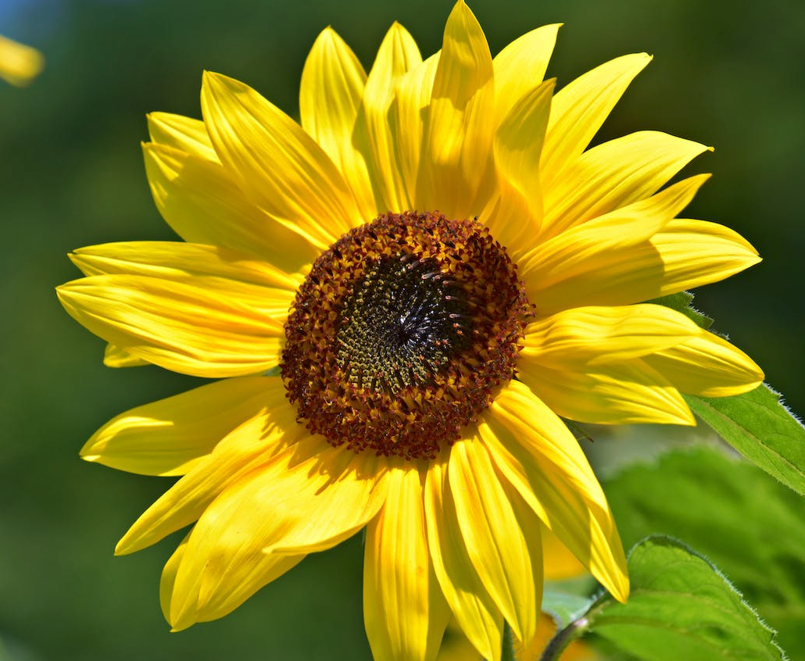

# Camera Calibration

This module performs the calibration of a camera:
- It is necessary to establish depth references for our digital theremin.
- It is based on a flat surface or the detection of an object (such as a chessboard) in various poses.
- It allows for the correction of nonlinear camera distortions and normalizes depth measurement.

# Theory

## Distortion

Without delving into the extensive literature on the subject (see e.g., [1]), a preliminary calibration of the camera in our digital theremin helps estimate both intrinsic and extrinsic parameters of the camera, in order to estimate the depth (distance) of the hand from the camera, as well as its direction (the line that the optical center projects with the object that hits the pixel), and possibly undistort images based on the camera properties.

The two main (nonlinear) sources of distortion that a real (pinhole) camera introduces are:

- **Radial (barrel) distortion**: This typically occurs due to unequal bending of light. The rays bend more near the edges of the lens than the rays near the center of the lens. This causes real straight lines to appear curved in the image, as light rays deviate radially inward or outward from their ideal location before hitting the image sensor. It becomes more severe the further the points are from the center of the image. There are two types of radial distortion effects:

- **Barrel distortion**: This corresponds to negative radial displacement

  

- **Pincushion distortion**: This corresponds to positive radial displacement

  

- **Tangential (pincushion) distortion**: This usually occurs when the image screen or sensor is at an angle relative to the lens. That is, the image-taking lens is not perfectly aligned parallel to the imaging plane. Thus, the image appears tilted and stretched.

  

Some sources add two alternative types of distortion: decentering distortion and thin prism distortion, which have both radial and tangential effects simultaneously. But in practice, we will proceed with the models presented.

## Equations

Radial distortion can be modeled as follows:

$$
x_{\text{corr}} = x \left( 1 + k_1 r^2 + k_2 r^4 + k_3 r^6 \right)
$$

$$
y_{\text{corr}} = y \left( 1 + k_1 r^2 + k_2 r^4 + k_3 r^6 \right)
$$

where:
- $(x, y)$ are the coordinates of a point in the image without correction.  
- $(x_{\text{corr}}, y_{\text{corr}})$ are the corrected coordinates.  
- $r^2 = x^2 + y^2$ is the distance to the optical center.  
- $k_1, k_2, k_3$ are the radial distortion coefficients.

Tangential distortion can be modeled as follows:

$$
x_{\text{corr}} = x + \left[ 2p_1 xy + p_2 (r^2 + 2x^2) \right]
$$

$$
y_{\text{corr}} = y + \left[ p_1 (r^2 + 2y^2) + 2p_2 xy \right]
$$

where $p_1$ and $p_2$ are the tangential distortion coefficients.

In other words, we need to find 5 parameters (the distortion coefficients): $k_1$, $k_2$, $p_1$, $p_2$, and $k_3$.

# Intrinsic and Extrinsic Parameters

In addition to this, we need other information, such as the camera's intrinsic and extrinsic parameters.

The **intrinsic** parameters are specific to a camera and include information such as the focal length $(f_x, f_y)$ and the optical centers $(c_x, c_y)$. The focal length and the optical centers can be used to create a camera matrix, which eliminates distortion caused by the lenses of a specific camera. The camera matrix is unique to a particular camera, so once calculated, it can be reused in other images taken with the same camera. Ignoring secondary terms such as the position of the principal point $(u_0, v_0)$, this matrix is expressed as a 3×3 matrix:

$$
\text{camera matrix} = \begin{bmatrix} f_x & 0 & c_x \\ 0 & f_y & c_y \\ 0 & 0 & 1 \end{bmatrix}
$$

The **extrinsic** parameters correspond to the rotation and translation vectors, which transform the coordinates of a 3D point to the 2D coordinate system of the image plane. For stereo applications, the distortions must first be corrected. To find these parameters, we need to provide images of a well-defined pattern (e.g., a chessboard). We identify specific points whose positions are known both in a global coordinate system (defined by us) and in a local relative one (e.g., the corners of the squares in the chessboard). We know the coordinates of these points in real space and also know their coordinates in the image, so we can solve for the distortion coefficients.

In the pinhole camera model, the relationship between a 3D point $(X, Y, Z)$ in the real world and its projection $(x, y)$ on the image is expressed as:

$$
\begin{bmatrix} s x \\ y \\ 1 \end{bmatrix} = A \begin{bmatrix} R & t \end{bmatrix} \begin{bmatrix} X \\ Y \\ Z \\ 1 \end{bmatrix}
$$

where:
- $A$ is the intrinsic camera matrix (includes focal length and optical center),
- $R$ and $t$ are the extrinsic parameters (rotation and translation) that transform the object's coordinate system to the camera's system,
- $s$ is a scale factor.

Additionally, in this model, the image is formed through a projection where the relationship [5] holds:

$$
\frac{W_{\text{image}}}{f} = \frac{W_{\text{real}}}{D} \quad \Leftrightarrow \quad D = \frac{W_{\text{image}}}{f} \cdot W_{\text{real}}
$$

where:
- $W_{\text{image}}$ is the width (in pixels) that the object occupies in the image,
- $W_{\text{real}}$ is the real width of the object (in real units, e.g., centimeters),
- $f$ is the focal length of the camera (in pixels), obtained from the calibration,
- $D$ is the distance from the object (the hand, in this case) to the camera.

In other words, if we know the real size of the hand and measure the width of the hand in the image (e.g., using the bounding box width), we can estimate the distance $D$. In practice, we can fix or average the real width of the hand if we are only interested in relative distances.

Once the distance $D$ is estimated, a frequency is assigned to the theremin through linear interpolation:

$$
\text{frequency} = f_{\text{min}} + \frac{(f_{\text{max}} - f_{\text{min}}) \cdot (D_{\text{max}} - D_{\text{min}})}{D_{\text{max}} - D}
$$

based on the minimum (maximum frequency) and maximum (minimum frequency) distances that the hand can be from the camera.

# Code

We will use OpenCV for a direct implementation via the Zhang method, which is highly efficient because it disregards the third dimension ($Z=0$) by taking advantage of the flatness of the chessboard and using the absolute conic. To achieve better results, at least 10 captures of the test pattern are recommended.

Once calibration is performed (by running the script `calibrate_camera.py`), the module `DepthThereminModule.py` loads the calibration parameters (`camera_matrix.npy` and `dist_coeffs.npy`), calculates the distance of the hand to the (optical center of the) camera using the pinhole model relationship (for the transferred frame), and maps the obtained distance to a frequency within the desired range.

## Expected (typical) calibration output

Camera matrix (intrinsics):

$$
\begin{bmatrix}
645.55943408 & 0 & 307.89848378 \\
0 & 643.63968725 & 217.9791421 \\
0 & 0 & 1
\end{bmatrix}
$$

Distortion coefficients:

$$
\begin{bmatrix}
1.53998080e-01 & -1.55735397e+00 & 3.97229586e-03 & -6.74556627e-03 & 4.57114464e+00
\end{bmatrix}
$$

Reprojection error: 0.09189841017624988  
Parameters saved in 'camera_matrix.npy' and 'dist_coeffs.npy'.

# See also

See this website [4] where they manually build and explain the concepts of a pinhole camera. And this article from Medium for the history of the pinhole camera [5].

# References

[1] Birchfield, Stan. Image Processing and Analysis (Activate Learning with these NEW titles from Engineering!), 1st ed., Cengage Learning, 2017.  

[2] https://docs.opencv.org/4.x/dc/dbb/tutorial_py_calibration.html  

[3] https://learnopencv.com/understanding-lens-distortion/  

[4] https://www.diyphotography.net/the-comprehensive-tech-guide-to-pinhole-photography/  

[5] https://medium.com/swlh/estimating-the-object-distance-using-the-camera-obscura-formulas-and-lens-equations-python-7baaa75a26b8
